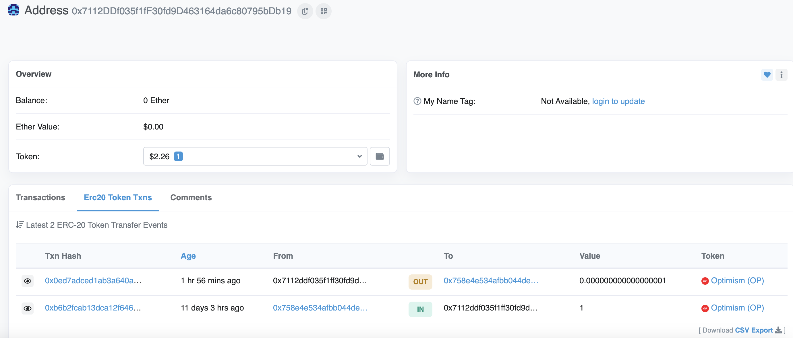
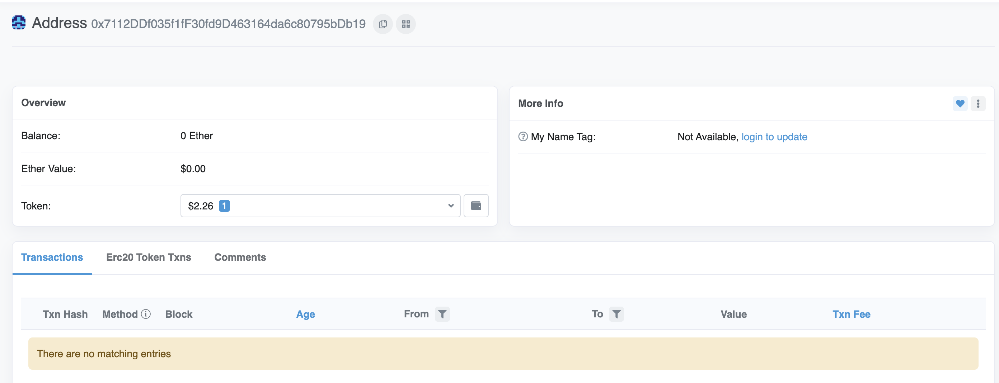

# ERC-2612:无GAS转账

## 实战例子

当时看到ARB空投泄漏的私钥第一反应就是看下ARB是否可以使用 `permit`函数，等黑客领到币之后直接转走。后面再推特上看到这个大佬使用该方法帮助粉丝抢回一定的币。

1. [0xAA_Science 通过Arb代币的permit授权大战黑客](https://twitter.com/0xAA_Science/status/1639248965102362624)

学会了个这个方法，再搭个私有节点 。下次有这种机会就可以battle一下了。

## Tips

1. 该方法属于ERC20的扩展，涉及的知识比较多，需要耐心一点一点理解其中的逻辑。建议先看[dai.sol](https://github.com/makerdao/dss/blob/master/src/dai.sol?ref=hackernoon.com)的实现。

## Why ？

这是一个 2020-04-13，Martin) Lundfall创建的[提案](https://eips.ethereum.org/EIPS/eip-2612)。属于ERC20代币功能的拓展，可以让用户A在没有ETH代币支付GAS费的情况下向用户B支付用户A所拥有的ERC代币。这是一个常见的情况，比如你的某个不常用的地址在ETH网络上收到100DAI，你要把这100DAI转移到常用的地址上，你首先需要向这个不常用的地址转一些ETH作为GAS费，才能把DAI转出来。如果DAI代币实现了ERC-2612这个扩展功能(确实实现了，而且在ERC-2612发布之前)，那么就可以不需要转移任何ETH到不常用的账户，就可以把该地址的DAI转移到常用账户。

## What

- 无GAS转账不是不需要GAS费就可以完成代币的转移，只不过是原本需要由用户A承担的GAS费可以转嫁用户B，或者服务的提供商身上。
- 首先由用户A提供的批准用户B使用他的DAI代币的链下的签名，用户B拿到由用户A提供的签名就行授权，再完成转账。这样对于用户A来说，只用提供链下的签名，他不用付出任何GAS的成本，所以称为无GAS转账。用户B则需要支付2笔交易的gas的费来完成转账。
- 本质来说，就是用户A把授权代币的操作通过链下签名的方式委托给了第三方。

## How

### 1. 用户A提供签名

提供签名首先需要知道要对什么内容进行签名。
ERC2612按照ERC712的签名标准规定了对批准他人使用ERC代币的方法提供了签名的标准方法。一共规定了三个函数

```
function permit(address owner, address spender, uint value, uint deadline, uint8 v, bytes32 r, bytes32 s) external
function nonces(address owner) external view returns (uint)
function DOMAIN_SEPARATOR() external view returns (bytes32)

```

其中

```
function permit(...) external

```

就是用户B拿着用户A签名可以调用的函数

首先看下[op.sol](https://optimistic.etherscan.io/address/0x4200000000000000000000000000000000000042#code)中permit函数的实现来看链下签名需要哪些内容

```
function permit(
        address owner,
        address spender,
        uint256 value,
        uint256 deadline,
        uint8 v,
        bytes32 r,
        bytes32 s
    ) public virtual override {
        require(block.timestamp <= deadline, "ERC20Permit: expired deadline");

        bytes32 structHash = keccak256(abi.encode(_PERMIT_TYPEHASH, owner, spender, value, _useNonce(owner), deadline));
  
  
		 ////////////////// 这个这是hash的内容
        bytes32 hash = _hashTypedDataV4(structHash);   
         //////////////////

        address signer = ECDSA.recover(hash, v, r, s);
        require(signer == owner, "ERC20Permit: invalid signature");

        _approve(owner, spender, value);
    }
```

进一步查看

```
    function _hashTypedDataV4(bytes32 structHash) internal view virtual returns (bytes32) {
        return ECDSA.toTypedDataHash(_domainSeparatorV4(), structHash);
    }
```

发现使用的标准的EIP712 hashTypeData的签名方法。
签名分为两个部分

1. DOMAIN_SEPARATOR 第一部分用于确认该签名只能用于这一个合约
2. structHash  第二部分用于确认该签名只能用于这一个函数

ERC2612规定了这两部分签名的内容

```
DOMAIN_SEPARATOR = keccak256(
    abi.encode(
        keccak256('EIP712Domain(string name,string version,uint256 chainId,address verifyingContract)'),
        keccak256(bytes(name)),
        keccak256(bytes(version)),
        chainid,
        address(this)
));
```

```
{
  "message": {
    "owner": owner,
    "spender": spender,
    "value": value,
    "nonce": nonce,
    "deadline": deadline
  }}
```

把这个两部分的消息的hash再进行hashTypeData签名就可以得到需要签名的消息。

然后我们就可以使用用户A的私钥对消息进行签名，得到最终可以使用的签名。

### 2. 用户B使用签名完成授权，转账

1. 用户B拿着用户A提供的签名调用op的 `permit`函数可以完成代币的授权。
2. 用户B再调用op的 `transferFrom`函数就可以完成代币的转移

### 3.实例



1. 用户B拿到用户A的签名我们就可以调用OP的 `permit`函数，对用户A的TOKEN就行授权。
2. 我向一个空地址 `0x7112DDf035f1fF30fd9D463164da6c80795bDb19`(用户A)转了1个OP
3. 然后通过permit函数授权 `0x596De5582cbeDEac1880aac59035C80C4e113875`(用户B)转走了0.1*-18E个OP到 `0x758e4E534AFBB044Dea64AB07e5d783fEc7e1541`(我在用的一个地址)
4. 在这个过程过用户A没有支付任何GAS，两笔交易费用都由用户B承担了。



### 4.代码

提供了js代码，ethers.js提供了 `_signTypedData`函数非常便捷的可以完成permit的签名。
需要自己配置下abi和私钥

```javascript
const { ethers } = require("ethers");

require("dotenv").config();

const provider = new ethers.providers.JsonRpcProvider(process.env.RPC_URL);

const wallet = new ethers.Wallet(process.env.PRIVATE_KEY_OWNER, provider);

const wallet_spender = new ethers.Wallet(process.env.PRIVATE_KEY_SPENDER, provider);

OP_NAME = "Optimism";
OP_ADDRESS = "0x4200000000000000000000000000000000000042";
OP_CHAIN_ID = "10";


SPENDER = "0x596De5582cbeDEac1880aac59035C80C4e113875"; //使用代币的地址
OWNER="0x7112ddf035f1ff30fd9d463164da6c80795bdb19" //拥有代币的地址

//通过abi连接合约
const abi = require("./op.json");
const op = new ethers.Contract(
  OP_ADDRESS,
  abi,
  wallet

)

async function main_fuc(){


  const domain = {
    name: "Optimism",
    version: "1",
    chainId: OP_CHAIN_ID, 
    verifyingContract: OP_ADDRESS,
  };

  const types = {
    Permit: [
      { name: "owner", type: "address" },
      { name: "spender", type: "address" },
      { name: "value", type: "uint256" },
      { name: "nonce", type: "uint256" },
      { name: "deadline", type: "uint256" },
    ],
  };

const value = ethers.constants.MaxUint256; 

const nonce = await op.nonces(wallet.address);
const deadline = ethers.constants.MaxUint256;
const message = {
  owner: wallet.address,
  spender: SPENDER,
  value: value,
  nonce: nonce,
  deadline: deadline,
};

//使用钱包A生成链下的签名
const signature = await wallet._signTypedData(domain, types, message);

const { v, r, s } = ethers.utils.splitSignature(signature);

const op2 = new ethers.Contract(
  OP_ADDRESS,
  abi,
  wallet_spender

)
//使用钱包B调用op的permit函数
resut =await op2.permit(OWNER, SPENDER, value, deadline, v, r, s)
console.log(resut)

}
main_fuc()

```

## 参考资料

1. Martin Lundfall ([@Mrchico](https://github.com/Mrchico)), "ERC-2612: Permit Extension for EIP-20 Signed Approvals," *Ethereum Improvement Proposals*, no. 2612, April 2020. [Online serial]. Available: https://eips.ethereum.org/EIPS/eip-2612.
2. https://hackernoon.com/how-to-code-gas-less-tokens-on-ethereum-43u3ew4
3. https://wtf.academy/solidity-application/Signatur
